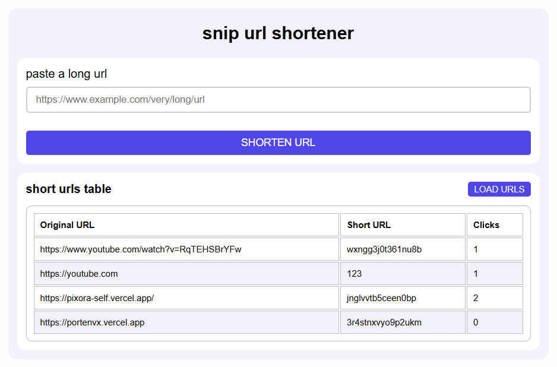

# Snip URL Shortener

Snip is a minimal URL shortener built with Go, PostgreSQL, and HTMX. It provides a simple web UI and fast redirects backed by a relational database.


<p align="center">Snip version 1.0 - a minimal URL shortener</p>

## Features

- Create short URLs from long URLs
- Redirect short codes to the original URL
- Basic click tracking
- Simple HTML UI with HTMX

## Tech Stack

- Go 1.26+
- PostgreSQL
- HTMX
- pgxpool
- golang-migrate

## Quick Start

1. Copy `.example.env` to `.env` and fill in the values.
2. Run database migrations.
3. Start the server.

```bash
go run ./cmd/migrator up
go run ./cmd/snip
```

The server listens on `SERVER_ADDR` (for example `:3000`).

## Configuration

Set these environment variables in `.env`:

- `DATABASE_URL` Connection string used by the app
- `DATABASE_MIGRATION_URL` Connection string used by the migrator
- `SERVER_ADDR` Server listen address (example `:3000`)

## API

- `GET /` Render the home page UI
- `POST /shorten` Accepts JSON `{"url":"https://example.com"}` and returns an HTML table row
- `GET /e/{code}` Redirects to the original URL
- `GET /shorten-urls` Returns HTML table rows for all stored URLs

## Project Structure

- `cmd/snip` Application entrypoint
- `cmd/migrator` Database migrator
- `internal/api` HTTP server and handlers
- `internal/database` Database connection setup
- `internal/generator` Short code generator
- `internal/shortener` Shortening logic
- `internal/validator` URL validation
- `migrations` SQL migrations
- `web/templates` HTML templates
- `web/static` CSS and static assets

## Development

Run all tests:

```bash
go test ./...
```

Build the server binary:

```bash
go build -o snip ./cmd/snip
```

## Migrations

Run migrations:

```bash
go run ./cmd/migrator up
```

Rollback migrations:

```bash
go run ./cmd/migrator down
```

Check migration version:

```bash
go run ./cmd/migrator version
```

## Notes

- The current UI relies on HTMX and expects HTML rows in handler responses.
- Static assets are served from `web/static` via the Go file server.

[Notes](docs/notes.md) -
[Feature ideas](docs/features.md)
